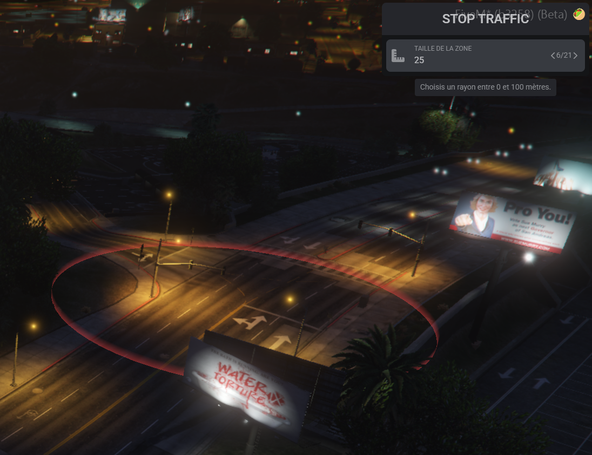
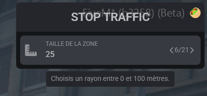
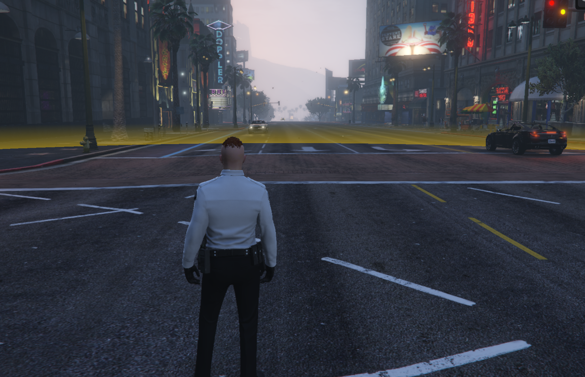
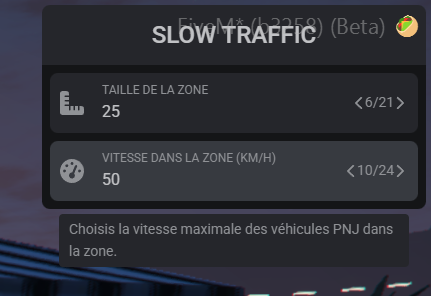
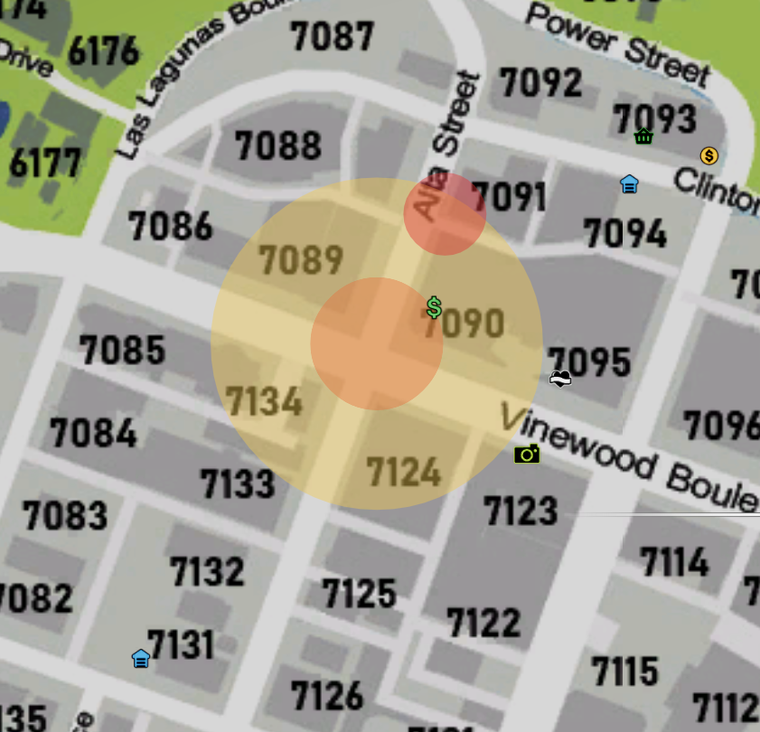

# pc-stoptraffic

Traffic control zones for FiveM/QBCore.

This resource lets authorized jobs create:
- **Stop Traffic** zones (NPC vehicles forced to `0 km/h`)
- **Slow Traffic** zones (NPC vehicles limited to a custom speed in `km/h`)

It includes:
- in-world preview marker,
- minimap radius display,
- job/on-duty restrictions,
- Discord webhook embeds,
- optional debug logs.

---

## Preview Images

Add your screenshots/gifs here.

### Stop Traffic Preview



### Slow Traffic Preview



### Minimap View



---

## Dependencies

- `qb-core`
- `ox_lib`

---

## Commands

- `/stoptraffic`  
	Open the Stop Traffic menu and create a `0 km/h` zone.

- `/slowtraffic`  
	Open the Slow Traffic menu and choose:
	- radius
	- speed limit (km/h)

- `/stoptrafficoff`  
	Remove the closest zone you are currently inside (works for both stop and slow zones).

---

## How It Works

1. Authorized player runs `/stoptraffic` or `/slowtraffic`.
2. A preview circle appears in-world and on minimap.
3. Player confirms by pressing Enter in the menu.
4. Zone is synced to all players.
5. Authorized job members can see minimap circles.
6. `/stoptrafficoff` removes a zone when the player is inside it.

---

## Configuration

Edit [config.lua](config.lua).

### Main Settings

- `Config.Job`  
	Allowed job(s).

- `Config.RequireOnDuty`  
	Require player to be on duty.

- `Config.Commands`  
	Command names.

- `Config.Radius`  
	Radius range and step.

- `Config.Slow.Speed`  
	Slow zone speed range/default/step (km/h).

### Visual Settings

- `Config.Marker`  
	In-world marker style.

- `Config.Preview`  
	Preview minimap colors.

- `Config.Minimap`  
	Active zone minimap display.

### Debug

- `Config.Debug = true/false`  
	Enables/disables console debug logs.

### Discord Webhook

- `Config.Webhook.Enabled`
- `Config.Webhook.Url`
- `Config.Webhook.Username`
- `Config.Webhook.AvatarUrl`
- `Config.Webhook.IncludePosition`
- `Config.Webhook.Colors`

Webhook events:
- Stop zone created
- Slow zone created
- Zone removed

All webhook text is configurable in:
- `Config.Locale.Webhook`

---

## Localization

All user-facing texts are in:
- `Config.Locale`

Webhook embed texts are in:
- `Config.Locale.Webhook`

You can translate everything from `config.lua` without changing script logic.

---

## Installation

1. Put `pc-stoptraffic` in your resources folder.
2. Ensure dependencies are started.
3. Add this resource to your server config.

Example:

```cfg
ensure ox_lib
ensure qb-core
ensure pc-stoptraffic
```

---

## Notes

- Speed values are set in km/h in menu/config, then converted internally.
- Zone removal requires being inside the target zone.
- Minimap visibility is restricted to authorized job members (and duty if required).

---

## Support

If needed, open an issue with:
- your `config.lua` (without private webhook URL),
- server/client console logs,
- reproduction steps.

